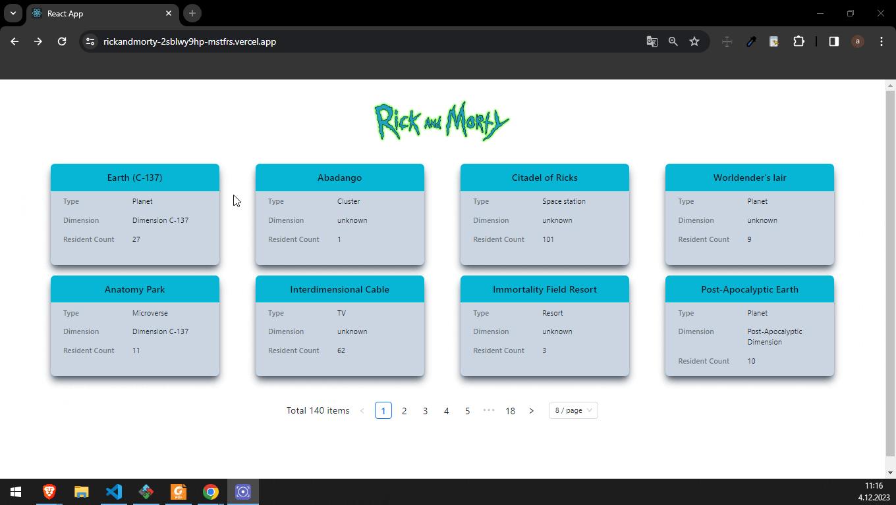

●	Rick and Morty Case Study

## Table of contents

  - [The challenge](#the-challenge)
  - [Screenshot](#screenshot)
  - [Project Skeleton ](#project-skeleton)
  - [Links](#links)
  - [Built with](#built-with)
  - [Installation](#Installation)  
  - [Author](#author)

## The challenge

Hello. I used ReactJs, TypeScript,Tailwind CSS, Redux Toolkit, Redux Thunk, React Router, Ant Design, axios technologies in the project.

The project consists of 3 pages. On the first page, location information retrieved from the Rick and Morty API is displayed in grid order.

When you click over the location, you are able to see all or filter the characters with status indicator(dead, alive or unknown for that selected location.)

On Characters Page, when you click on one of the character names, you are redirected to the character details page.


## Project Skeleton

```
●	Rick and Morty Case Study
|
|----readme.md       
SOLUTION
├── public
│     └── assets
├── src
│    ├── components
│    │       ├── CardAvatar
│    │       |    ├── index.tsx
│    │       ├── CharacterCard
│    │       |    ├── index.tsx
│    │       ├── CharacterDetailCard
│    │       |    ├── index.tsx
│    │       ├── CharacterList
│    │       |    ├── index.tsx
│    │       ├── Header
│    │       |    ├── index.tsx
│    │       ├── LoadingPage
│    │       |    ├── AvatarLoading
│    │       |    |  ├── index.tsx
│    │       |    ├── CardLoading
│    │       |    |  ├── index.tsx
│    │       ├── LocationCard
│    │       |    ├── index.tsx
│    │       ├── LocationCardList
│    │       |    ├── index.tsx
│    │       ├── Paginate
│    │       |    ├── index.tsx
│    ├── pages
│    │       ├── CharacterDetail
│    │       |    ├── index.tsx
│    │       ├── Characters
│    │       |    ├── index.tsx
│    │       ├── Home
│    │       |    ├── index.tsx
│    ├── Redux
│    │       ├── characterSlice.tsx
│    │       ├── locationSlice.tsx
│    │       ├── store.tsx
│    ├── Router
│    │       ├── AppRouter.tsx
│    ├── Services
│    │       ├── serviceHelpers.tsx
│    │       ├── rickandmorty.service.tsx   │    │      
│    ├── Types
│    │       ├── Type.tsx
│    ├── App.tsx
│    ├── App.css
│    ├── index.tsx
│    └── index.css
├── package.json
└── yarn.lock
```
## Screenshot
<p align="left">
<a href="https://rickandmorty-2sblwy9hp-mstfrs.vercel.app"></a>
</p>

## Links
<hr>
<b>Check The Live Website ➡️</b> <a href="rickandmorty-2sblwy9hp-mstfrs.vercel.app"> Live Website </a> 
<hr>

### Built with

- `@ReactJs`
- `@TypeScript`
- `@reduxjs/toolkit`
- `react-redux`
- `redux-Thunk`
- `axios`
- `react-router-dom`
- `Tailwind CSS`
- `Ant design`


### Installation

1. Clone this project:

   ```bash
     Clone the project: https://github.com/mstfrs/rickandmorty.git
   ```
2. Install the necessary dependencies:

   ```bash
   npm install / yarn
   ```
## Usage

1. Start the application:

   ```bash
   npm run start / yarn start
   ```
2. Open your web browser and go to [http://localhost:3000/](http://localhost:3000)

## Author

- Author - Mustafa ÖRS

<center> &#8987; Happy Coding  &#9997; </center>


